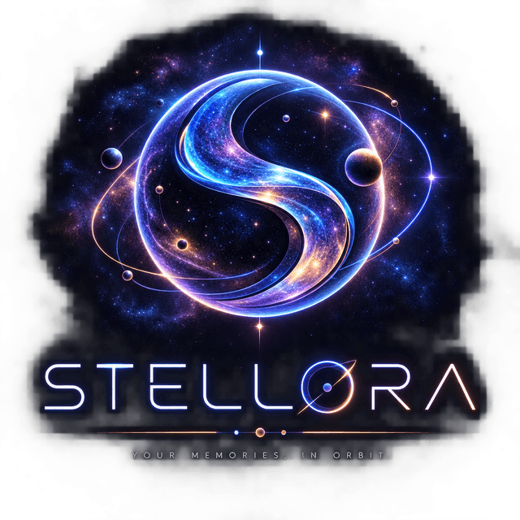

# Stellora

[](https://github.com/PeepSick/STELLORA/actions/workflows/ci.yml)
[](LICENSE)
[](https://react.dev)
[](https://threejs.org)
[](https://www.typescriptlang.org)
[](https://modelcontextprotocol.io)



### 🌌 [Try the live demo → stellora.peepsicklabs.com](https://stellora.peepsicklabs.com)

**Every memory is a star. Every story is a constellation.**

Stellora is a 3D "living galaxy" that renders your knowledge base, your personal
photo memories, and more as an explorable procedural galaxy in the browser —
built with **React 19**, **Three.js** (`@react-three/fiber` + `drei` +
`postprocessing`), **Zustand**, **Tailwind CSS v4**, and **Vite**.

No Stellora backend. Your data stays local unless you explicitly connect to an
external provider or service (GitHub, Nominatim, or your chosen AI provider).
The optional MCP server runs locally and exposes your data over stdio — no
network traffic, no cloud.

**At a glance**

- 📜 MIT-licensed code
- ™️ *Stellora* name & logo trademark-protected
- 🆓 Free forever
- 🖥️ Self-hostable
- 🚫 No backend
- 📡 No telemetry
- 🔑 Bring-your-own-key AI
- 🔌 MCP Server (Claude / OpenCode / Cursor)
- 🍴 Fork freely — just rename your fork


---

## 🎬 Demo video

<!--
  HOW TO ADD THE VIDEO:
  Easiest path — GitHub hosts video files dropped into any text box (an
  issue, a PR, a draft comment) and gives you a permanent CDN URL. Drag the
  .mp4 into a new issue/comment on this repo, copy the generated URL
  (looks like https://github.com/user-attachments/assets/xxxxxxxx-...),
  then replace this whole comment block with that URL on its own line —
  GitHub renders it as an inline HTML5 player automatically, no <video>
  tag needed. Delete the draft issue/comment afterwards; the asset URL
  keeps working on its own.

  Alternative — YouTube: replace this block with
    [](https://youtu.be/VIDEO_ID)
-->

*(full walkthrough video — coming soon)*

---

## ✨ Features

- **Knowledge Galaxy** — Markdown notes rendered as a 3D knowledge graph. Each
  note is a star; wikilinks (`[[Note Title]]`) become visible connections.
- **Stellora (Photo Memory) Galaxy** — your personal photo library, grouped
  **one node per calendar day** (a 30-photo day is one browsable node, not 30
  orbs). Real EXIF/GPS extraction via [`exifr`](https://github.com/mattiaasta/exifr),
  reverse-geocoded place names (OpenStreetMap/Nominatim — no API key), and a
  per-day story field with manual Favorite / Important / Archived marks that feed
  a **Memory Score** driving how prominently each day's star renders.
- **Finance Corpus in 3D** *(toggle)* — drop economy/finance reference files into
  `src/data/economy/finance` and they're searchable by default, with an option
  to promote the whole corpus to a full 3D node field from Settings (sized down
  so a large archive of glow sprites doesn't white out the scene).
- **Music Galaxy** *(toggle)* — drop audio files into `src/data/music/` and they
  appear automatically as nodes (same auto-discovery pattern as the gallery).
  A default track (whichever loaded file is named "deep space", else the
  first one found) starts on first interaction and keeps playing as you
  browse Memory nodes — clicking a Music node cross-fades to its track
  instead, never overlapping two at once. No external API key required.
- **Git Galaxy** *(toggle)* — paste any public GitHub repository URL in Settings
  and its commits are fetched and rendered as a chained commit graph. GitHub API
  availability and rate limits may apply.
- **Timeline View** *(toggle)* — overlays a temporal reference axis with year
  tick marks on the galactic plane.
- **Collaborative Mode** *(toggle)* — sync the galaxy across browser tabs on the
  same origin via the `BroadcastChannel` API. No server needed.
- **Export / Import** *(toggle)* — save or load the whole galaxy (nodes,
  connections, settings, AI config, marks) as a JSON file.
- **Theme Engine** — Dark / Light / Aurora / Custom presets applied live via CSS
  variables.
- **AI Chat (agentic) + Talk button** — click the core orb to open a chat panel
  backed by real tool-calling, not just text replies: the model can search
  your memory days by date/date-range/location/people-count/free-text
  (`gallery_search`), open a match in the 3D view (`open_memory`), browse the
  node graph (`list_nodes`), and create connections (`connect_nodes`). The
  **Talk** button right under the orb skips typing entirely — one click starts
  listening, the transcript goes through the exact same pipeline as typed
  text, and the reply is read back with text-to-speech. **Gemini** (Google AI
  Studio) is the default provider; **Custom** (any OpenAI-compatible endpoint)
  ships pre-filled for a local **Ollama** server so voice/chat works fully
  offline with no key at all — every provider is bring-your-own-key, kept in
  browser `localStorage`, sent straight to the provider you chose. Voice
  replies use Gemini's own native TTS model when a real Gemini key is set
  (noticeably better quality), and fall back to the browser's built-in
  SpeechSynthesis otherwise — Talk always produces a spoken reply, key or
  no key, and either path picks a voice matching the reply's actual
  language rather than a fixed UI setting.
- **Free forever. Bring your own AI key.** 🔑 No paid tier, no metered API on our
  side, no cost to self-host — you only pay your chosen provider for the tokens
  you use.
- **Internationalization** — **English is the base language**; Turkish is
  included and auto-selected when the browser locale starts with `tr`. Switch
  manually from Settings.
- **Performance-aware** — an R3F `PerformanceMonitor` adapts render quality, and
  large corpora stay search-only until you opt in.
- **MCP Server** — connect Claude Desktop, OpenCode, Cursor, or any
  MCP-compatible AI tool to your galaxy. Access your notes, photo memories,
  and finance corpus directly from your AI assistant. Ships as
  `@stellora/mcp` with stdio transport.

> **Privacy note:** No automated face or identity recognition is performed.
> Stellora can count how many people appear in a photo (a number you supply),
> but it does not identify, name, or cluster people across photos.

---

## 🚀 Getting started

```bash
npm install
npm run dev
```

Open the printed local URL — that's the **marketing landing page** (`/`).
The actual interactive galaxy lives at **`/app`** (click "Enter Live Demo" or
go there directly: `http://localhost:5173/app`). The two are separate,
lazily-loaded bundles — the landing page never downloads Three.js, and the
app never downloads landing-only code.

Once in the app: use the **left control panel** to switch galaxy sources, the
**bottom dock** to open Dashboard / Systems / Orbs / Analytics / Archive /
**Settings**, and click the **core orb** (or the **Talk** button beneath it)
to chat with your graph.

### Landing page config

The landing page's CTAs are environment-configurable, no hardcoded URLs:

| Variable | Default | Purpose |
|---|---|---|
| `VITE_DEMO_URL` | `/app` | Where "Enter Live Demo" / "Enter Stellora" link to |
| `VITE_DEMO_VIDEO_URL` | *(unset)* | Product-demo video URL — unset shows a "coming soon" placeholder instead of a fake video |

Set these in a `.env.production` (or your host's environment variables) if
the landing page and app are ever split across different domains/subdomains.

### Optional data folders

Stellora auto-discovers content dropped into these folders (no code changes
needed):

| Folder | What it does |
|---|---|
| `src/data/business`, `ops`, `product`, `sourcing` | Markdown notes → Knowledge graph |
| `src/data/economy/finance` | Reference corpus → searchable (and 3D when enabled) |
| `src/data/gallery` | Personal photos → Stellora memory nodes |
| `src/data/music` | Audio files → Music Galaxy nodes |

### AI chat setup

Go to **SETTINGS → AI PROVIDER**, pick a provider, and paste your own API key.
Everything stays local to your browser (`localStorage`) and is sent straight
to the provider you chose — no backend in between.

- **Gemini** (default) — get a free key from
  [aistudio.google.com/apikey](https://aistudio.google.com/apikey) and paste
  it in. This is a normal per-user API key, not a GCP service account, so it's
  safe to keep client-side like every other provider here.
- **Claude / OpenAI / DeepSeek / Z.AI** — paste your key from that provider.
- **Custom** — any OpenAI-compatible `/chat/completions` endpoint. Ships
  pre-filled for a local [Ollama](https://ollama.com) server
  (`http://localhost:11434/v1`, no real key needed) so chat/voice works fully
  offline — just run `ollama pull llama3.2` (or your model of choice) and
  make sure Ollama is running. Change the Base URL/model to point anywhere
  else.

---

## 🧪 Scripts

| Command | Description |
|---|---|
| `npm run dev` | Start the Vite dev server |
| `npm run build` | Production build |
| `npm run build:lib` | Build as a reusable ES module (`dist/stellaris.js`) |
| `npm run preview` | Preview the production build |
| `npm run typecheck` | TypeScript type checking (`tsc --noEmit`) |
| `npm run test` | Run unit tests (Vitest) |
| `npm run lint` | Lint with ESLint |
| `npm run mcp:build` | Build the MCP server |
| `npm run mcp:start` | Start the MCP server (stdio) |

---

## ⚙️ Feature flags

Every optional galaxy feature is gated behind a flag in **Settings** (stored in
`localStorage`). All flags default to **on** and every galaxy source is shown
out of the box, so a fresh clone shows everything at first launch — turn off
what you don't need:

- Finance Corpus in 3D
- Timeline View
- Music Galaxy
- Git Galaxy
- Collaborative Mode
- Export / Import
- Theme preset (Dark / Light / Aurora / Custom)
- Language (Auto / English / Turkish)

---

## 🗂️ Project structure

```
src/
  main.tsx       Routing (/app vs landing) + lazy-loads both bundles
  App.tsx        The Stellora app entry (mounted at /app)
  Landing.tsx    Marketing landing page (mounted at /)
  components/
    landing/     Landing-only pieces (e.g. the animated starfield backdrop)
  galaxy/        Three.js scene, node & connection rendering, post-processing
  ui/            Control panel, context/detail panels, dock, chat, settings
  data/          Markdown/photo/music loaders (auto-discovery via import.meta.glob)
  services/      AI chat client (Gemini/Claude/OpenAI-compatible), TTS, GitHub fetcher, export/import
  hooks/         localStorage-backed edits, audio engine, music controller, collab sync
  store/         Zustand store (single source of truth)
  i18n/          English (base) + Turkish dictionaries and t()
  utils/         Galaxy math, theme presets, fuzzy search, memory score, music player
  shaders/       Custom GLSL (orbs, connections, nebula, starfield)

packages/
  mcp/           MCP server — connect Claude/OpenCode/Cursor to your galaxy
```

---

## 🔌 MCP Server

Stellora ships with a [Model Context Protocol](https://modelcontextprotocol.io)
server (`@stellora/mcp`) so AI assistants can browse your knowledge base, photo
memories, and finance corpus directly.

### Available tools

| Tool | Description |
|------|-------------|
| `notes_search` | Search knowledge galaxy by query |
| `notes_read` | Read full note content by ID |
| `notes_list` | List all notes with metadata |
| `gallery_search` | Search photo memories |
| `gallery_get` | Get a specific day's memory |
| `gallery_list` | List all memory days |
| `finance_search` | Search the finance/economy reference corpus |
| `finance_read` | Read a finance article's full content by ID |
| `git_get` | Fetch recent commits from a GitHub repo |
| `galaxy_stats` | Get galaxy statistics |
| `galaxy_sources` | List available data sources |

### Setup

```bash
cd packages/mcp
npm install
npm run build
```

### Claude Desktop

Add to `~/Library/Application Support/Claude/claude_desktop_config.json`
(macOS) or `%APPDATA%\Claude\claude_desktop_config.json` (Windows):

```json
{
  "mcpServers": {
    "stellora": {
      "command": "node",
      "args": ["/absolute/path/to/stellora/packages/mcp/dist/index.js"],
      "env": {
        "STELLORA_DATA_DIR": "/absolute/path/to/stellora/src/data"
      }
    }
  }
}
```

### OpenCode

Add to `~/.config/opencode/opencode.json`:

```json
{
  "mcpServers": {
    "stellora": {
      "command": "node",
      "args": ["/absolute/path/to/stellora/packages/mcp/dist/index.js"],
      "env": {
        "STELLORA_DATA_DIR": "/absolute/path/to/stellora/src/data"
      }
    }
  }
}
```

### Cursor

Add to `.cursor/mcp.json` in your project root:

```json
{
  "mcpServers": {
    "stellora": {
      "command": "node",
      "args": ["/absolute/path/to/stellora/packages/mcp/dist/index.js"],
      "env": {
        "STELLORA_DATA_DIR": "/absolute/path/to/stellora/src/data"
      }
    }
  }
}
```

See [`packages/mcp/README.md`](packages/mcp/README.md) for full documentation.

---

## 🔒 Privacy & philosophy

- **Client-side only.** No backend, no analytics, no telemetry.
- **Bring-your-own-key AI.** Keys never leave your browser and go straight to
  the provider you chose — including Gemini, a normal per-user API key with
  its own quota, not a broad-access GCP credential.
- **No face recognition.** People counts only; no identity claims.

---

## 📄 License

Stellora is released under the **MIT License** (see [LICENSE](LICENSE)) for the
code. The **"Stellora" name, logo, and official visual identity are reserved**
to the original project — see the [Trademark & Brand Policy](TRADEMARK.md).

> Stellora is free to use, modify and self-host. The Stellora name, logo and
> official visual identity remain reserved to the original project.

Forking, modifying, and self-hosting is welcome — just publish your fork under a
**different name** (e.g. GalaxyCore, MyGalaxy, Stellar Explorer), not as
"Stellora".
